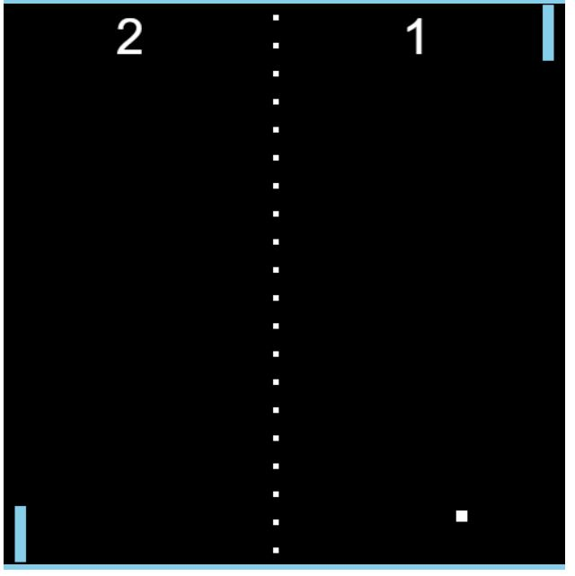

## Pong: A Classic Two-Player Game

##### This JavaScript code brings the classic arcade game Pong to life in your web browser! Challenge a friend to a competitive match, controlling paddles to volley a ball back and forth. Score points by letting the ball past your opponent's paddle.

## Features:

- Two-Player Gameplay: Supports two players controlling separate paddles using keyboard controls.
- Smooth Movement: The game utilizes requestAnimationFrame for smooth paddle and ball animations.
- Ball Physics: The ball bounces realistically off the top and bottom walls, as well as player paddles.
- Scorekeeping: Keeps track of each player's score, displayed on the canvas.
- Game Over Reset: Upon scoring a point, the ball automatically resets to the center and players can continue.
- Basic Visuals: Uses simple shapes and color to represent players and the ball, maintaining a classic feel.

## Getting Started

- Prerequisites: Ensure you have a basic understanding of HTML, CSS, and JavaScript.

## Set Up Files:

- Create two files: pong.html and pong.js.
- Copy the HTML code provided in this README into pong.html.
- Copy the JavaScript code provided in this README into pong.js.

## Run the Game:

1. Open the pong.html file in your web browser.
2. Use the keyboard arrows to control your player paddles (Up/Down for Player 2, W/S for Player 1).

### The code is organized into several key functions:

- window.onload: This function executes when the web page finishes loading. It performs the following tasks:
- Retrieves a reference to the HTML canvas element with the ID "board".
- Sets the width and height of the canvas to create the game board.
  -Obtains the 2D drawing context for the canvas, used for drawing game elements.
- Initializes player and ball objects with their positions, sizes, and velocities.
- Starts the game loop using requestAnimationFrame for smooth animation.
- Adds event listeners for "keyup" events to handle player movement.
- update: This function is called repeatedly within the game loop, responsible for - updating the game state and drawing the game elements. Here's what it does:
  Clears the canvas to prepare for a new frame.
- Updates player positions based on their velocities and checks for out-of-bounds movement.
- Updates the ball's position based on its velocities, bouncing it off the top and bottom walls.
- Checks for collision between the ball and player paddles, reversing its horizontal velocity upon collision.
- Resets the game (ball position and player movement) upon a player scoring a point.
- Renders player paddles and the ball on the canvas.
- Displays the current score for each player on the canvas.
- Draws a dotted line down the middle of the board for a visual divider.
- outOfBounds: This function takes a player's Y position and checks if it's within the canvas boundaries (top and bottom).
- movePlayer: This function detects key presses (Up/Down or W/S) and sets the corresponding player's velocity for movement.
- detectCollision: This function takes two objects as arguments and checks for collision using bounding box intersection logic. It returns true if a collision occurs, otherwise false.
- resetGame: This function resets the ball's position and velocity to the center of the board based on the direction of the winning player (-1 for Player 1, 1 for Player 2).

